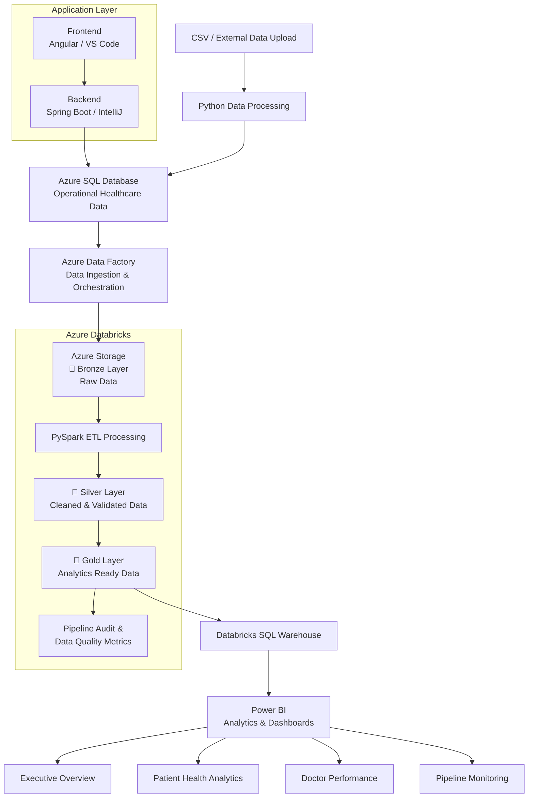
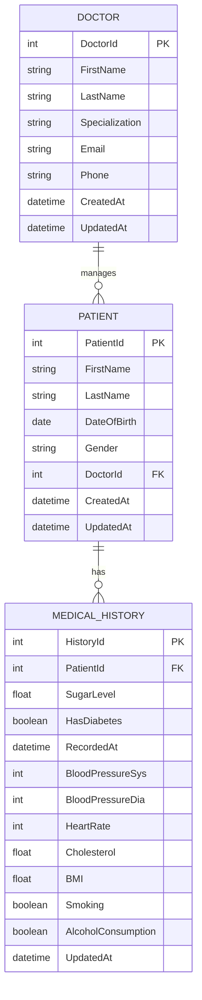
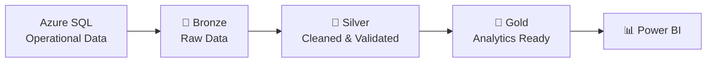
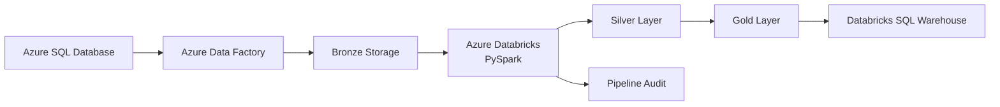
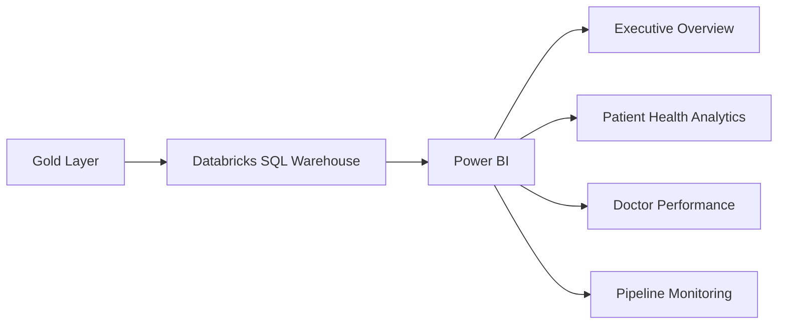
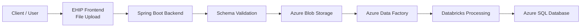
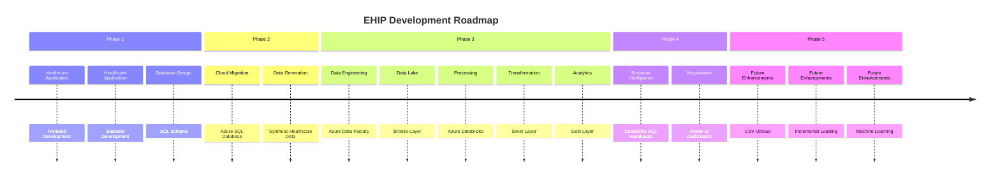

# 🏥 EHIP — Enterprise Healthcare Intelligence Platform

> An end-to-end Healthcare Management, Data Engineering, and Analytics Platform built using modern full-stack and cloud technologies.

EHIP (Enterprise Healthcare Intelligence Platform) is a full-stack healthcare management application integrated with a modern cloud-based data engineering and analytics architecture.

The project demonstrates the complete journey of healthcare data—from operational data generated by an application to cloud storage, distributed data processing, analytics-ready datasets, and interactive business intelligence dashboards.

---

## 🚀 Project Overview

EHIP combines two major domains into a single end-to-end system:

### 🏥 Healthcare Management System

A full-stack application responsible for managing healthcare operations such as:

- Doctor management
- Patient management
- Medical history management
- Authentication and authorization
- Healthcare record management

### 📊 Data Engineering & Analytics Platform

Healthcare operational data is processed through a modern Azure-based data pipeline following the **Medallion Architecture**:

```text
Bronze → Silver → Gold
```

The final analytics-ready datasets are consumed by Power BI to generate healthcare insights and monitor data pipeline performance.

---

# 🏗️ Complete System Architecture



---

# 🔄 End-to-End Data Flow

The complete lifecycle of healthcare data follows the architecture below:


### Data Flow Summary

```text
Frontend
    ↓
Backend APIs
    ↓
Azure SQL Database
    ↓
Azure Data Factory
    ↓
Azure Storage - Bronze Layer
    ↓
Azure Databricks + PySpark
    ↓
Silver Layer
    ↓
Gold Layer
    ↓
Databricks SQL Warehouse
    ↓
Power BI Analytics
```

---

# ☁️ Azure Cloud Architecture

The project uses multiple Azure services to build an end-to-end cloud data platform.

| Azure Service | Purpose |
|---|---|
| Azure SQL Database | Operational healthcare database |
| Azure Data Factory | Data ingestion and orchestration |
| Azure Blob Storage | Raw and processed data storage |
| Azure Databricks | Distributed data processing |
| PySpark | Data transformation and ETL |
| Databricks SQL Warehouse | Analytics query serving |
| Power BI | Business intelligence and visualization |

---

# 🗄️ Database Architecture

The operational healthcare database currently consists of three core entities.



### Entity Relationships

```text
Doctor
   │
   │ 1 : N
   ▼
Patient
   │
   │ 1 : N
   ▼
Medical History
```

### Core Tables

#### 👨‍⚕️ Doctor

Stores doctor information including:

- Doctor ID
- Name
- Specialization
- Email
- Phone
- Created timestamp
- Updated timestamp

#### 🧑 Patient

Stores patient information including:

- Patient ID
- Name
- Date of birth
- Gender
- Assigned doctor
- Created timestamp
- Updated timestamp

#### ❤️ Medical History

Stores patient healthcare information including:

- Sugar level
- Diabetes status
- Blood pressure
- Heart rate
- Cholesterol
- BMI
- Smoking status
- Alcohol consumption
- Medical record timestamp

---

# 🥉🥈🥇 Medallion Architecture

The data engineering pipeline follows the **Medallion Architecture**, where data progressively improves in quality as it moves through the pipeline.



---

## 🥉 Bronze Layer — Raw Data

The Bronze layer contains raw data extracted from the Azure SQL operational database.

Azure Data Factory performs the ingestion process.

### Purpose

- Preserve raw source data
- Maintain ingestion history
- Enable data reprocessing
- Maintain source-level traceability

### Entities

```text
bronze/
│
├── doctor/
├── patient/
└── medical_history/
```

Data is stored in Azure Storage before being processed by Databricks.

---

## 🥈 Silver Layer — Cleaned & Validated Data

The Silver layer is created using Azure Databricks and PySpark.

Data undergoes cleaning, validation, and standardization.

### Transformations

- Null handling
- Duplicate removal
- Data type conversion
- Column standardization
- Data validation
- Basic data quality checks

The cleaned datasets are stored in an optimized format for further processing.

---

## 🥇 Gold Layer — Analytics Ready Data

The Gold layer contains business-ready datasets optimized for analytics and reporting.

The following analytical datasets are generated.

### Patient Health Analytics

Contains detailed patient-level healthcare insights.

Features include:

- Patient name
- Doctor information
- Specialization
- Age
- Age group
- BMI
- BMI category
- Sugar level
- Sugar category
- Blood pressure category
- Cholesterol category
- Diabetes status
- Smoking status
- Alcohol status

---

### Doctor Performance

Provides doctor-level operational insights.

Metrics include:

- Doctor ID
- Doctor name
- Specialization
- Patient count
- Average patient age

---

### Hospital KPIs

Provides executive-level healthcare metrics.

Metrics include:

- Total patients
- Total doctors
- Total medical records
- Average BMI
- Average patient age
- Average sugar level
- Diabetic records
- High blood pressure records
- High cholesterol records

---

### Pipeline Audit

Provides observability into the data engineering pipeline.

Metrics include:

- Pipeline Run ID
- Entity
- Records read
- Records processed
- Invalid records
- Processing status
- Processing timestamp

---

# 🔥 Data Engineering Pipeline

The pipeline processes data from Azure SQL Database through Azure Data Factory and Azure Databricks.



---

# ⚙️ Data Engineering Workflow

### Step 1 — Data Generation

Synthetic healthcare data is generated for:

- Doctors
- Patients
- Medical History

The generated datasets are initially stored as CSV files.

---

### Step 2 — Azure SQL Data Loading

Python scripts are used to load CSV datasets into Azure SQL Database.

```text
CSV Files
    ↓
Python Script
    ↓
Azure SQL Database
```

The Azure SQL Database acts as the operational source system.

---

### Step 3 — Azure Data Factory Ingestion

Azure Data Factory copies data from the operational Azure SQL Database to Azure Storage.

```text
Azure SQL
    ↓
Azure Data Factory
    ↓
Bronze Layer
```

Separate ingestion activities are used for:

- Doctor
- Patient
- Medical History

---

### Step 4 — Databricks Processing

Azure Databricks reads raw Bronze data and processes it using PySpark.

```text
Bronze
   ↓
Data Cleaning
   ↓
Data Validation
   ↓
Silver
   ↓
Business Transformations
   ↓
Gold
```

---

### Step 5 — Analytics Serving

Gold datasets are exposed through Databricks SQL Warehouse.

```text
Gold Layer
    ↓
Databricks SQL Warehouse
    ↓
Power BI
```

---

# 📊 Power BI Analytics Dashboard

The Power BI dashboard consists of four major analytical pages.

---

## 1️⃣ Executive Overview

Provides a high-level overview of hospital operations and healthcare metrics.

### Key KPIs

- Total Patients
- Total Doctors
- Total Medical Records
- Diabetic Records
- Average BMI
- Average Sugar Level

### Key Insights

- Patient demographics
- Gender distribution
- BMI distribution
- Diabetes distribution
- Age group analysis

---

## 2️⃣ Patient Health & Risk Analytics

Provides deeper insights into patient health patterns and risk indicators.

### Analysis

- Blood pressure distribution
- Cholesterol categories
- Sugar level analysis
- BMI distribution
- Diabetes patterns
- Smoking analysis
- Alcohol consumption analysis
- Age-based health insights
- BMI vs Sugar Level correlation

---

## 3️⃣ Doctor Performance & Workload Analytics

Provides insights into healthcare workforce distribution.

### Analysis

- Patient workload by doctor
- Patient count by specialization
- Average patient age
- Doctor workload distribution

---

## 4️⃣ Data Pipeline Monitoring

Provides observability and monitoring of the data engineering pipeline.

### Metrics

- Records Read
- Records Processed
- Invalid Records
- Data Quality Percentage
- Processing trends
- Pipeline execution status
- Entity-level processing
- Pipeline audit logs

---

# 📈 Power BI Dashboard Architecture



---

# 🛠️ Technology Stack

## 💻 Application Development

| Technology | Purpose |
|---|---|
| Angular | Frontend application |
| Spring Boot | Backend REST APIs |
| Java | Backend programming |
| IntelliJ IDEA | Backend development |
| VS Code | Frontend development |

---

## 🗄️ Database

| Technology | Purpose |
|---|---|
| Azure SQL Database | Cloud operational database |
| SQL | Database querying and management |

---

## ☁️ Data Engineering

| Technology | Purpose |
|---|---|
| Python | Data generation and database ingestion |
| Azure Data Factory | Data ingestion and orchestration |
| Azure Blob Storage | Data lake storage |
| Azure Databricks | Distributed data processing |
| PySpark | ETL and transformations |
| Parquet / Delta | Analytical data storage |
| Medallion Architecture | Data lake architecture |

---

## 📊 Analytics

| Technology | Purpose |
|---|---|
| Databricks SQL Warehouse | Analytical query serving |
| Power BI | Business intelligence dashboards |
| DAX | Analytical measures and KPIs |

---

# 📁 Repository Structure

```text
EHIP-Healthcare-Intelligence-Platform/
│
├── README.md
├── .gitignore
│
├── frontend/
│   └── EHIP-Frontend/
│       ├── src/
│       ├── package.json
│       └── ...
│
├── backend/
│   └── EHIP-Backend/
│       ├── src/
│       ├── pom.xml
│       └── ...
│
├── database/
│   │
│   ├── schema/
│   │   └── ehip_schema.sql
│   │
│   ├── procedures/
│   │   └── stored_procedures.sql
│   │
│   └── sample-data/
│       └── README.md
│
├── data-engineering/
│   │
│   ├── data-generation/
│   │   ├── generate_data.py
│   │   ├── load_to_azure_sql.py
│   │   └── requirements.txt
│   │
│   ├── azure-data-factory/
│   │   ├── pipelines/
│   │   ├── datasets/
│   │   ├── linked-services/
│   │   └── README.md
│   │
│   ├── databricks/
│   │   ├── notebooks/
│   │   │   ├── 01_medallion_pipeline.py
│   │   │   └── 02_pipeline_audit.py
│   │   │
│   │   └── README.md
│   │
│   └── architecture/
│       └── data-architecture.md
│
├── powerbi/
│   │
│   ├── EHIP_Analytics.pbix
│   │
│   ├── screenshots/
│   │   ├── executive-overview.png
│   │   ├── patient-health-analytics.png
│   │   ├── doctor-performance.png
│   │   └── pipeline-monitoring.png
│   │
│   └── README.md
│
├── docs/
│   ├── architecture.md
│   ├── azure-resources.md
│   ├── setup-guide.md
│   └── project-roadmap.md
│
└── screenshots/
    └── architecture-overview.png
```

---

# 🔐 Security Considerations

Sensitive credentials are intentionally excluded from the repository.

The following should **never** be committed to GitHub:

```text
❌ Azure SQL Passwords
❌ Azure Connection Strings
❌ Databricks Personal Access Tokens
❌ Azure Storage Keys
❌ API Keys
❌ Service Principal Secrets
❌ .env Files
```

Use environment variables for sensitive configuration.

Example:

```text
DB_SERVER=
DB_NAME=
DB_USERNAME=
DB_PASSWORD=

AZURE_STORAGE_ACCOUNT=
AZURE_STORAGE_KEY=

DATABRICKS_HOST=
DATABRICKS_TOKEN=
```

---

# 🔄 Future Data Ingestion Architecture

A planned enhancement is to allow users to upload external datasets through the frontend.



The system will validate uploaded datasets against the expected healthcare schema before ingestion.

Potential supported formats:

- CSV
- Excel
- JSON
- Structured healthcare datasets

---

# 🚀 Future Enhancements

## Application

- [ ] CSV file upload functionality
- [ ] External dataset ingestion
- [ ] Advanced authentication
- [ ] Role-based dashboards
- [ ] Improved healthcare record management

---

## Data Engineering

- [ ] Incremental data loading
- [ ] Change Data Capture (CDC)
- [ ] Delta Lake implementation
- [ ] Parameterized ADF pipelines
- [ ] Automated pipeline triggers
- [ ] Advanced data quality validation
- [ ] Data lineage tracking
- [ ] Automated Databricks job execution

---

## Analytics

- [ ] Predictive patient risk scoring
- [ ] Advanced Power BI drill-through
- [ ] Real-time healthcare analytics
- [ ] Trend forecasting
- [ ] Automated anomaly detection

---

## Machine Learning

Potential future implementations include:

- [ ] Diabetes risk prediction
- [ ] Cardiovascular risk prediction
- [ ] Patient health risk scoring
- [ ] Medical anomaly detection
- [ ] Patient readmission prediction

---

# 🎯 Key Learning Outcomes

This project provides hands-on experience with:

- Full Stack Application Development
- Angular
- Spring Boot
- REST APIs
- Relational Database Design
- Azure Cloud Services
- Azure SQL Database
- ETL / ELT Pipelines
- Azure Data Factory
- Azure Blob Storage
- Azure Databricks
- PySpark
- Medallion Architecture
- Data Lake Architecture
- Data Quality Engineering
- Pipeline Observability
- Analytical Data Modeling
- Databricks SQL Warehouse
- Power BI
- DAX
- Cloud Data Engineering Architecture
- Git and GitHub Version Control

---

# 📈 Project Status

## Application Layer

- [x] Healthcare database design
- [x] Doctor management
- [x] Patient management
- [x] Medical history management
- [x] Authentication and authorization
- [ ] CSV upload functionality
- [ ] Advanced application integration

## Data Engineering Layer

- [x] Synthetic data generation
- [x] Azure SQL Database deployment
- [x] Python data loading
- [x] Azure Data Factory ingestion
- [x] Bronze layer implementation
- [x] Databricks PySpark processing
- [x] Silver layer implementation
- [x] Gold layer implementation
- [x] Pipeline audit implementation
- [x] Databricks SQL Warehouse integration

## Analytics Layer

- [x] Power BI connection
- [x] Executive Overview Dashboard
- [x] Patient Health Analytics
- [x] Doctor Performance Analytics
- [x] Data Pipeline Monitoring

---

# 🧭 Project Roadmap



---

# 🎯 Why This Project?

Modern applications generate large amounts of operational data, but storing data in a transactional database alone does not provide meaningful business insights.

EHIP demonstrates how a real-world system can bridge the gap between:

```text
Operational Application
        ↓
Transactional Database
        ↓
Cloud Data Engineering
        ↓
Distributed Processing
        ↓
Analytics Ready Data
        ↓
Business Intelligence
```

The project is designed to simulate how modern enterprises build integrated application and data platforms.

---

# 👨‍💻 Author

**Shivam**

Electronics & Telecommunication Engineering Student

Aspiring:

- Full Stack Developer
- Data Engineer
- Cloud Engineer

---

# ⭐ Project Highlights

- 🏥 Full-stack healthcare management system
- ☁️ Azure cloud-based architecture
- 🔄 End-to-end ETL pipeline
- 🥉🥈🥇 Medallion Architecture
- 🔥 Distributed data processing using PySpark
- 📊 Healthcare analytics dashboards
- 📈 Pipeline monitoring and observability
- 🔐 Cloud database integration
- 🚀 Scalable architecture for future development

---

## 📌 Note

This project is actively evolving. Future enhancements will focus on automated ingestion, incremental processing, advanced analytics, and machine learning-based healthcare intelligence.
